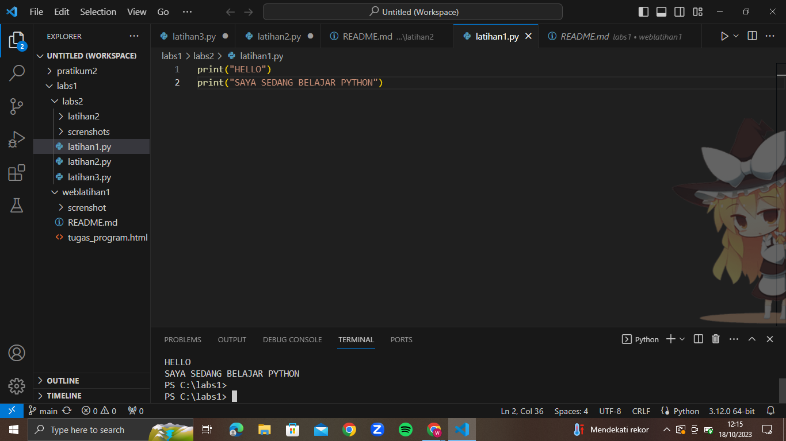
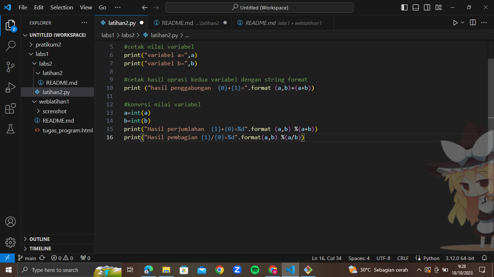
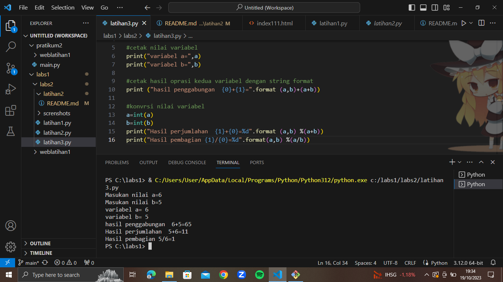

# LATIHAN1
 ### MEMBUAT PARAGRAF

 kode tag pragraf `
`
 menampilkan tulisan "hello" dilayar
 menampilkan tulisan "saya sedang belajar python"dilayar

# LATIHAN2
 ### MEMBUAT PARAGRAF

 kode tag pragraf `
`
 menjumlahkan dua buah bilangan a dan b
 

# LATIHAN3
 ### MEMBUAT PARAGRAF

 kode tag pragraf `
`
 nilai variabel dari keyboard berikut dengan screnshots
